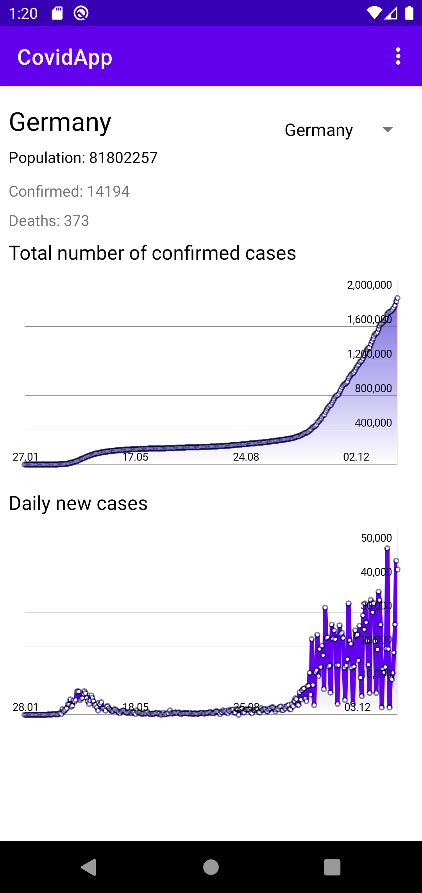

# Covid 19 Tracker
Andorid application for tracking Covid-19 spread.  
All data displaying in application are fetching from following API: [https://about-corona.net/](https://about-corona.net/)

## Core functionalities
* Displaying information of selected country: population, number of confirmed cases and deaths today,
* Displaying two charts, displaying total and daily number of confirmed cases,
* Possibility to change selected country using spinner,
* Possibility to determine user location using GPS or location set in phone settings.

## Technologies and libraries used:
The application was written using the latest solutions for creating mobile applications for the Android platform, i.a. Kotlin Coroutines, Andorid Navigation Component, LiveData, Lifecycle components, Dagger Hilt.
Other libraries used:  
* MPAndroidChart
* Retrofit
* ROOM

